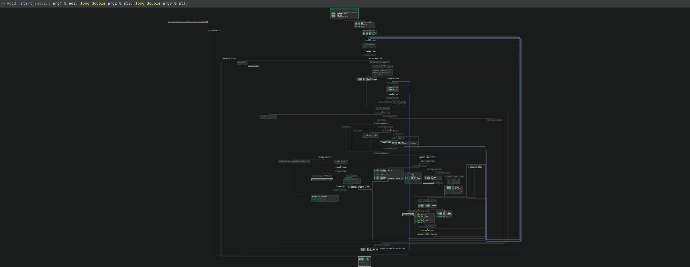
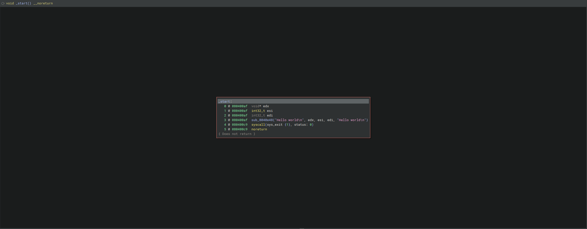

# Native Predicate Solver
Author: **ScriptWare Software**

_Native C++ Binary Ninja plugin for removing opaque predicates_

## Description:

This plugin removes conditional branches that always evaluate to the same value. Written in C++ for speed - faster than the [Python version](https://github.com/Vector35/OpaquePredicatePatcher/), especially on large binaries. Uses multiple threads to process functions in parallel, and will iteratively perform passes through functions to clean up newly uncovered opaque predicates. You should be able to remove annoying opaque predicates from massive functions with ease and speed.

### Example

Before:

After:

## Installation Instructions

### Windows

Copy to: `%APPDATA%\Binary Ninja\plugins\`

### Linux

Copy to: `~/.binaryninja/plugins/`

### Darwin (macOS)

Copy to: `~/Library/Application Support/Binary Ninja/plugins/`

## Usage

Click → `Plugins` → `Native Predicate Solver`:
- `Patch Opaque Predicates (Current Function)` - Patches current function only
- `Patch Opaque Predicates (All Functions)` - Patches entire binary

## Settings

Found in Binary Ninja Settings under "Native Predicate Solver":

| Setting | Default | Description |
|---------|---------|-------------|
| Max passes per function | 10 | Times to re-analyse each function |
| Max global passes | 20 | Times to re-analyse entire binary |
| Thread count | 8 | Worker threads for parallel processing |

## How It Works

1. Scans MLIL for conditional branches
2. Checks if conditions are constant (always true/false)
3. Patches them:
   - Always false → NOP (removes branch)
   - Always true → Unconditional jump
4. Repeats until no more predicates found

## Minimum Version

This plugin was developed via this version of Binary Ninja:

* 5.0

## Required Dependencies

The following dependencies are required for this plugin:

* None (all dependencies are included in the Binary Ninja API)

## License

This plugin is released under a MIT license.

## Metadata Version

2
